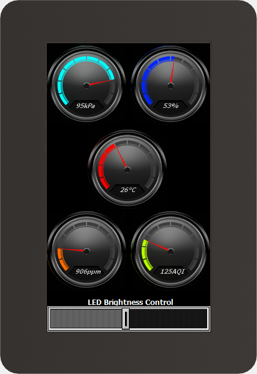

# RDK4 Environment Monitoring Station Example

This is a demonstration of the sensors SHT41 [temperature and humidity], DPS310 [atmospheric pressure], SGP40 [air quality index], SCD41 [CO2 concentration], and the smart display GEN4-ULCD-43DCT-CLB. Everything is connected to the main controller - **RDK4** board.

**NOTE:** The SB55 has to be removed and SB54 has to be shorted on the bottom side of RDK4 to enable the  Arduino +5V supply from the USB-C KitProg3 terminal. It will hold current up to 400 mA only.

## Requirements

- [ModusToolbox&trade; software](https://www.infineon.com/modustoolbox) v3.1 or later (tested with v3.1).

- The latest hardware release [RDK4 Rev2](https://github.com/RutronikSystemSolutions/RDK4_Hardware_Files).

- [RAB1-SENSORFUSION](https://github.com/RutronikSystemSolutions/RAB1-SENSORFUSION_Hardware_Files) adapter board.

- [RAB2-CO2](https://github.com/RutronikSystemSolutions/RAB2-CO2_Hardware_Files) adapter board.

   

## Using the code example

Create the project and open it using one of the following:

<b>In Eclipse IDE for ModusToolbox&trade; software</b>

1. Click the **New Application** link in the **Quick Panel** (or, use **File** > **New** > **ModusToolbox&trade; Application**). This launches the [Project Creator](https://www.infineon.com/ModusToolboxProjectCreator) tool.

2. Pick a kit supported by the code example from the list shown in the **Project Creator - Choose Board Support Package (BSP)** dialogue.

   When you select a supported kit, the example is reconfigured automatically to work with the kit. To work with a different supported kit later, use the [Library Manager](https://www.infineon.com/ModusToolboxLibraryManager) to choose the BSP for the supported kit. You can use the Library Manager to select or update the BSP and firmware libraries used in this application. To access the Library Manager, click the link from the **Quick Panel**.

   You can also just start the application creation process again and select a different kit.

   If you want to use the application for a kit not listed here, you may need to update the source files. If the kit does not have the required resources, the application may not work.

3. In the **Project Creator - Select Application** dialogue, choose the example by enabling the checkbox.

4. (Optional) Change the suggested **New Application Name**.

5. The **Application(s) Root Path** defaults to the Eclipse workspace which is usually the desired location for the application. If you want to store the application in a different location, you can change the *Application(s) Root Path* value. Applications that share libraries should be in the same root path.

6. Click **Create** to complete the application creation process.

For more details, see the [Eclipse IDE for ModusToolbox&trade; software user guide](https://www.infineon.com/MTBEclipseIDEUserGuide) (locally available at *{ModusToolbox&trade; software install directory}/docs_{version}/mt_ide_user_guide.pdf*).

## Legal Disclaimer

The evaluation board including the software is for testing purposes only and, because it has limited functions and limited resilience, is not suitable for permanent use under real conditions. If the evaluation board is nevertheless used under real conditions, this is done at one’s responsibility; any liability of Rutronik is insofar excluded. 

